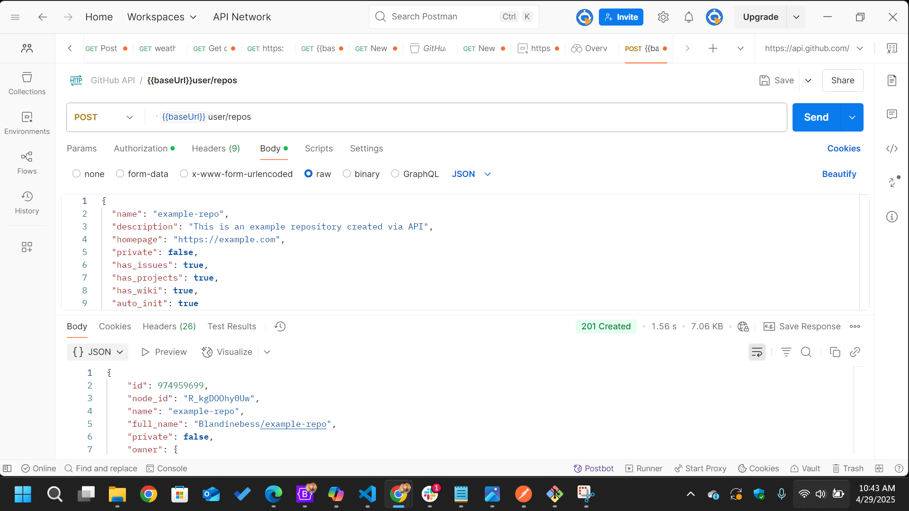
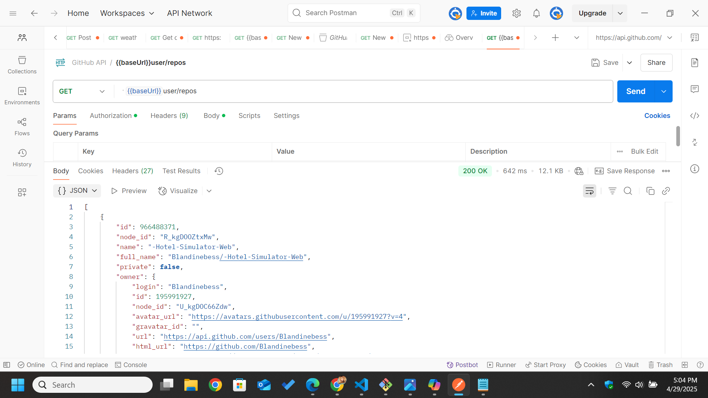

# Project Name

Interacting with GitHub's API

## Overview

Utilize Postman to interact with GitHub's API by retrieving user information and creating a new repository. Document the entire process, including the request setup and the response in your README.md file, accompanied by appropriate screenshots.

## Installation

Part 1: Retrieve User Information

- Set up the Request in Postman:
- Create a variable baseUrl with the value https://api.github.com/ in your GitHub API environment.
- Configure a new GET request to {{baseUrl}}user/repos.
- Add an Authorization header with your Bearer Token. Ensure it's correctly formatted as:Authorization: Bearer <your_token>
- Send the Request and Capture the Response:
- Execute the GET request to retrieve your repositories.
- Take screenshots showing:
- The request setup (headers, endpoint, etc.)
- The JSON response containing your user information.

Part 2: Create a New Repository

- Configure the POST Request:
- Create a new POST request in Postman within your GitHub API collection.
- Set the URL to {{baseUrl}}user/repos.
- Include a JSON body with the necessary fields for repository creation, such as:
{
  "name": "example-repository",
  "description": "My new GitHub repository",
  "private": false
}

- Execute and Document:
- Send the POST request to create the repository.
- Capture screenshots showing:
- Request configuration (URL, headers, JSON body).
- The response confirming successful creation.

Part 3: Documentation in README.md

- Update Documentation:
- Create a new section in your postman-reflection repository's README.md file.
- Document the steps for:
- Retrieving user information via the GET request.
- Creating a new repository via the POST request.

- Include your screenshots to visually demonstrate the process.

screenshots:


## Table of Contents

- [Overview](#overview)
- [Features](#features)
- [Installation](#installation)
- [API Endpoints](#api-endpoints-placeholder)
- [Screenshots](#screenshots)
- [Reflection](#overview)

## Features

List the key features of the project, such as:

- Interactive design
- Integration with APIs
- Responsive layout

## Installation

1. Clone the repository:

   ```bash
   git clone https://github.com/username/repository-name.git
   ```bash
   git clone https://github.com/username/repository-name.git
   
